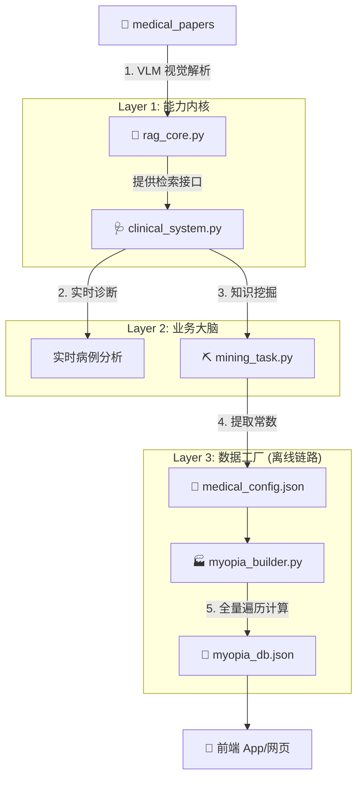

# 🏥 Intelligent Medical CDSS & Myopia Prediction Engine

**(基于 RAG 2.0 的临床决策支持与近视预测数据生成系统)**

本项目是一个双模态的医疗 AI 系统：

1.  **实时 CDSS 模式**：针对复杂病例进行实时的检索、分析、打分和疗效曲线拟合。
2.  **离线工厂模式**：利用 RAG 从文献中挖掘医学常数，结合数学算法，批量生成覆盖所有患者情况（种族/年龄/度数）的静态预测数据库（供前端 APP 毫秒级调用）。

-----

## 🧩 系统架构与代码关系

本系统采用 **“能力-业务-任务”** 分层架构，各文件各司其职，互不干扰。



### 文件逻辑关系速览

1.  **`rag_core.py` (地基)**：这是**大脑**。它不管业务，只管读懂 PDF 并提供搜索能力。
2.  **`clinical_system.py` (专家)**：这是**医生**。它调用 `rag_core` 查资料，然后利用内置的算法（Pydantic清洗、Scipy拟合、打分逻辑）进行思考。
3.  **`mining_task.py` (矿工)**：这是**任务脚本**。它指挥 `clinical_system` 去文献里把“近视增长率”和“治疗有效率”挖出来，存成配置文件。
4.  **`myopia_builder.py` (工厂)**：这是**算力中心**。它读取配置文件，写死循环遍历所有可能性（年龄x种族x度数），生成最终的大字典。

-----

## ✅ 解决的核心需求

本系统完美解决了你提出的以下六大需求：

| 需求痛点 | 解决方案 | 对应代码模块 |
| :--- | :--- | :--- |
| **1. 文献看不懂表格** | 引入 **VLM (LlamaParse)**，精准还原 PDF 中的表格和公式。 | `rag_core.py` |
| **2. $2^n$ 种病情检索** | **动态 Prompt**。将患者 JSON 动态转化为自然语言查询，语义匹配最相关段落。 | `clinical_system.py` |
| **3. 提取结构化方案** | **JSON Mode + Pydantic**。强制 LLM 从非结构化文本中提取标准 JSON 格式。 | `clinical_system.py` |
| **4. 方案打分与优选** | **双重评估算法**。算法 A (Python 硬计算) + 算法 B (LLM 软评估)。 | `clinical_system.py` |
| **5. 疗效曲线建模** | **LLM 挖点 + Scipy 拟合**。提取离散数据点，用对数函数拟合平滑曲线。 | `clinical_system.py` |
| **6. 覆盖所有情况的计算器** | **RAG 挖规律 + Python 算遍历**。AI 负责提取增长率常数，Python 负责裂变计算几万种组合。 | `mining_task.py` + `myopia_builder.py` |

-----

## 📂 文件详解：输入输出与功能

### 1\. `rag_core.py` (底层内核)

  * **功能**：系统基础设施。负责加载 API Key、调用 LlamaParse 解析 PDF、建立向量索引、执行重排序 (Rerank)。
  * **输入**：
      * `./medical_papers/` 文件夹中的 PDF 文件。
      * `.env` 文件中的 API Keys。
  * **输出**：
      * `./paper_storage.../`：持久化的向量数据库文件。
      * `get_rag_engine()`：返回一个可查询的引擎对象。

### 2\. `clinical_system.py` (业务编排)

  * **功能**：临床逻辑中心。封装了 `ClinicalAgent` 类，提供“患者分析”和“通用调研”两个接口。实现了数学拟合和打分逻辑。
  * **输入**：
      * **模式 A**：患者特征字典 (如 `{age: 8, disease: "Glaucoma"}`).
      * **模式 B**：调研 Prompt (如 "提取亚洲近视增长率").
  * **输出**：
      * **模式 A**：`EvaluationResult` 对象列表 (含打分、曲线参数)。
      * **模式 B**：清洗后的标准 JSON 数据。

### 3\. `mining_task.py` (挖掘任务)

  * **功能**：**自动化知识萃取脚本**。它定义了具体的 Prompt，指挥 Agent 去文献里挖掘“近视自然进展率”和“治疗有效率”。
  * **输入**：无 (Prompt 已写死在代码里)。
  * **输出**：
      * `medical_config.json`：包含提取出的医学常数 (Base Rates & Efficacies)。

### 4\. `myopia_builder.py` (数据构建)

  * **功能**：**离线数据生成器**。它读取常数，通过四层循环 (种族/性别/年龄/度数) 遍历计算每一种情况的预测曲线。
  * **输入**：
      * `medical_config.json` (由 Mining 任务生成)。
  * **输出**：
      * `myopia_db.json`：体积较大的最终字典文件。
  * **遍历范围**：
      * 种族：Asian, Caucasian
      * 年龄：6 - 16岁
      * 性别：Male, Female
      * 初始度数：-0.50D 至 -6.00D

-----

## 🚀 使用指南 (How to Run)

### 第一步：环境配置

1.  创建 `.env` 文件并填入 API Key：
    ```ini
    OPENAI_API_KEY=sk-...
    LLAMA_CLOUD_API_KEY=llx-...
    ```
2.  将 PDF 文献放入 `medical_papers` 文件夹。

### 第二步：运行知识挖掘 (Mining Phase)

这一步利用 AI 从文献中提取规律。

```bash
python mining_task.py
```

  * **结果**：生成 `medical_config.json`。你可以打开检查 AI 提取的数据是否准确。

### 第三步：运行全量构建 (Building Phase)

这一步利用 Python 算法生成全量数据。

```bash
python myopia_builder.py
```

  * **结果**：生成 `myopia_db.json`。
  * **控制台输出**：你会看到进度条，显示“预计生成组合数: X 种情况...”。

### (可选) 第四步：前端集成

前端开发者只需加载 `myopia_db.json`。

  * **调用逻辑**：
    用户输入：亚洲人，女孩，8岁，250度近视。
    前端生成 Key：`"Asian_Female_8_-2.5"`。
    直接查表：`db["Asian_Female_8_-2.5"]`。
    **响应时间：\< 1ms (无网络请求)。**

-----

## ⚠️ 注意事项

1.  **首次运行慢**：第一次运行 `mining_task.py` 或 `clinical_system.py` 时，rag\_core 会上传 PDF 到云端解析，这可能需要几分钟。解析完后会生成本地缓存，第二次运行就是秒开。
2.  **数据修正**：如果发现 `myopia_db.json` 生成的数据曲线不合理，请优先检查中间产物 `medical_config.json`。如果 AI 提取的常数有误，请手动修正该 JSON 文件，然后重新运行 `builder` 即可。

这是一个为您定制的详细 README 文档。我将采用\*\*“逐层解剖”\*\*的方式，按照数据流动的顺序，对每个代码文件的核心逻辑、功能以及它们之间的调用关系进行深度解析。

-----

# 🏥 Intelligent Myopia Prediction System (IMPS) - 技术架构文档

本项目是一个**双模态医疗 AI 系统**，结合了 **RAG (检索增强生成)** 的深度推理能力与 **预计算 (Pre-computation)** 的极速响应能力。

## 目录

1.  [系统全貌与文件关系](https://www.google.com/search?q=%231-%E7%B3%BB%E7%BB%9F%E5%85%A8%E8%B2%8C%E4%B8%8E%E6%96%87%E4%BB%B6%E5%85%B3%E7%B3%BB)
2.  [核心模块逐行解析](https://www.google.com/search?q=%232-%E6%A0%B8%E5%BF%83%E6%A8%A1%E5%9D%97%E9%80%90%E8%A1%8C%E8%A7%A3%E6%9E%90)
      * [Layer 1: 能力内核 (rag\_core.py)](https://www.google.com/search?q=%2321-rag_corepy---%E8%83%BD%E5%8A%9B%E5%86%85%E6%A0%B8)
      * [Layer 2: 业务大脑 (clinical\_system.py)](https://www.google.com/search?q=%2322-clinical_systempy---%E4%B8%9A%E5%8A%A1%E5%A4%A7%E8%84%91)
      * [Layer 3: 挖掘任务 (mining\_task.py)](https://www.google.com/search?q=%2323-mining_taskpy---%E7%9F%A5%E8%AF%86%E7%9F%BF%E5%B7%A5)
      * [Layer 4: 数据工厂 (myopia\_builder.py)](https://www.google.com/search?q=%2324-myopia_builderpy---%E6%95%B0%E6%8D%AE%E5%B7%A5%E5%8E%82)
      * [Layer 5: 用户终端 (index.html / index.py)](https://www.google.com/search?q=%2325-%E7%94%A8%E6%88%B7%E7%BB%88%E7%AB%AF---%E9%9B%B6%E5%BB%B6%E8%BF%9F%E5%89%8D%E7%AB%AF)
3.  [运行流程指南](https://www.google.com/search?q=%233-%E8%BF%90%E8%A1%8C%E6%B5%81%E7%A8%8B%E6%8C%87%E5%8D%97)

-----

## 1\. 系统全貌与文件关系

本系统采用 **“离线挖掘 -\> 编译构建 -\> 在线服务”** 的流水线架构。

  * **rag\_core.py**: 底层基建。负责读懂 PDF 并提供搜索接口。
  * **clinical\_system.py**: 逻辑中台。调用 rag\_core 查资料，并进行医学逻辑处理（打分、拟合）。
  * **mining\_task.py**: 任务脚本。使用 clinical\_system 从文献中提取医学常数，生成 `medical_config.json`。
  * **myopia\_builder.py**: 编译器。读取 `medical_config.json`，通过数学计算裂变出 2 万种组合，生成 `myopia_db.json`。
  * **index.html / index.py**: 前端。直接读取 `myopia_db.json` 进行毫秒级展示。

-----

## 2\. 核心模块逐行解析

### 2.1 `rag_core.py` - 能力内核

**功能**：系统的基础设施。集成 LlamaIndex，负责 PDF 解析、向量存储建立和语义检索。

**代码逻辑解析**：

  * **配置与导入 (Lines 1-33)**:
      * 引入 `LlamaParse` 用于处理复杂 PDF（表格还原），引入 `LLMRerank` 用于检索后重排序。
      * 配置 `Settings.llm` 和 `Settings.embed_model`，支持通过 `.env` 加载自定义的 API Base URL。
  * **`load_or_create_index` (Lines 64-106)**:
      * **VLM 解析**: 使用 `LlamaParse` 并注入指令 "Preserve all tables in Markdown format"，确保医学表格不丢失结构。
      * **结构化节点**: 使用 `MarkdownElementNodeParser` 将文档切分为文本节点和表格对象，分别建立索引。
      * **持久化**: 解析一次后将向量存入 `DEFAULT_STORAGE_DIR`，避免重复扣费。
  * **`get_rag_engine` (Lines 117-133)**:
      * **对外接口**: 这是本文件唯一暴露给上层业务的函数。
      * **Rerank 机制**: 构建查询引擎时加入了 `similarity_top_k=10` (初筛) 和 `LLMRerank(top_n=3)` (精排)，确保返回给大模型的内容是最相关的。

**与其他文件的联系**：

  * 被 `clinical_system.py` 导入并调用 `get_rag_engine()`。

-----

### 2.2 `clinical_system.py` - 业务大脑

**功能**：封装了医学业务逻辑的 Agent。具备“查资料”、“结构化提取”、“数学拟合”和“方案打分”能力。

**代码逻辑解析**：

  * **数据模型定义 (Lines 18-35)**:
      * 使用 Pydantic 定义 `TreatmentPlan` 和 `EvaluationResult` 类。这强制 LLM 输出严格的 JSON 格式（包含治愈率、副作用、时间曲线点）。
  * **`ClinicalAgent` 类 (Lines 39-146)**:
      * `__init__`: 初始化时调用 `get_rag_engine()` 连接底层内核。
      * `_extract_structured_plans`: 核心 Prompt 工程。将 RAG 检索到的乱码文本输入 LLM，强制要求返回 JSON 格式。
      * `_fit_curve`: **数学与 AI 的结合点**。使用 `scipy.optimize.curve_fit` 对 AI 提取的散点数据进行对数函数 ($y = a \cdot \ln(x) + b$) 拟合，生成平滑曲线参数。
      * `research_general_knowledge`: 一个通用的调研接口。输入自然语言指令（如“提取增长率”），输出清洗好的 JSON 字典。

**与其他文件的联系**：

  * 输入：调用 `rag_core.py` 的检索能力。
  * 输出：被 `mining_task.py` 调用以执行具体的挖掘任务。

-----

### 2.3 `mining_task.py` - 知识矿工

**功能**：自动化脚本。定义具体的 Prompt，指挥 Agent 从文献中挖掘出系统所需的“常数”。

**代码逻辑解析**：

  * **任务定义 (Tasks Dict)**:
      * **BASE\_RATES 任务**: 定义了极度详细的 Prompt，要求提取 6-16 岁、亚洲/高加索人种的近视年增长率。包含了“种族映射规则”（如将 Chinese 映射为 Asian）。
      * **TREATMENTS 任务**: 要求提取阿托品、OK镜等方案的有效率 (Efficacy Rates)。
  * **执行循环 (Lines 44-53)**:
      * 遍历任务列表，调用 `agent.research_general_knowledge(prompt)`。
  * **结果保存**:
      * 将挖掘到的数据保存为 `medical_config.json`。这是“离线计算”与“在线服务”的关键交接棒。

**与其他文件的联系**：

  * 调用：`clinical_system.py`。
  * 产出：`medical_config.json`（供 Builder 使用）。

-----

### 2.4 `myopia_builder.py` - 数据工厂

**功能**：编译器。它不进行 AI 推理，而是进行数学裂变。将有限的常数扩展为覆盖所有可能性的数据库。

**代码逻辑解析**：

  * **加载配置 (Lines 8-27)**:
      * [cite\_start]读取 `medical_config.json`，获取基础增长率表和治疗有效率 [cite: 1]。
  * **核心计算 `calculate_progression` (Lines 30-55)**:
      * **算法**: 这是一个纯数学函数。输入起始年龄、度数、增长率。
      * [cite\_start]**模拟**: `curr_red += rate` (自然增长)，`curr_green += rate * (1 - efficacy)` (干预后增长) [cite: 1]。
      * **输出**: 返回至 17 岁的完整时间轴数组。
  * **全量构建 `build_dictionary` (Lines 58-100)**:
      * [cite\_start]**四层循环**: 遍历 种族 (2) × 性别 (2) × 年龄 (6-16) × 初始度数 (-0.5 到 -6.0) [cite: 1]。
      * [cite\_start]**Key 生成**: 生成类似 `"Asian_Female_8_-2.5"` 的唯一键 [cite: 1]。
      * [cite\_start]**序列化**: 最终将包含约 2 万条数据的字典写入 `myopia_db.json` [cite: 1]。

**与其他文件的联系**：

  * 输入：`medical_config.json`。
  * 输出：`myopia_db.json`（供前端使用）。

-----

### 2.5 用户终端 - 零延迟前端

#### A. `index.html` (Web 版)

**功能**：无后端、纯静态的网页应用。
**解析**：

  * 使用 `fetch('./myopia_db.json')` 加载预计算好的大字典。
  * 监听下拉框变化，拼装 Key (如 `Asian_Female_8_-2.5`)。
  * 直接从 `db` 对象中获取数据，使用 Chart.js 绘制红绿对比曲线。响应时间 \< 1ms。

#### B. `index.py` (Desktop 版)

**功能**：基于 PyQt6 的桌面应用。
**解析**：

  * 功能逻辑与 Web 版完全一致。
  * 使用 `Matplotlib` 替代 Chart.js 进行绘图。
  * 包含了一个 `get_mock_data()` 方法，防止 JSON 文件缺失时程序崩溃。

-----

## 3\. 运行流程指南

要启动并运行本项目，请严格按照以下顺序操作：

1.  **环境准备**:

      * 配置 `.env` 文件（填入 OpenAI 和 LlamaCloud Key）。
      * 将 PDF 文献放入 `medical_papers/` 目录。

2.  **阶段一：知识挖掘 (Mining)**

      * 运行命令：`python mining_task.py`
      * *作用*：系统会阅读文献，生成 `medical_config.json`。
      * *检查*：打开生成的 json 文件，确认 AI 提取的增长率数据是否合理。

3.  **阶段二：数据编译 (Building)**

      * 运行命令：`python myopia_builder.py`
      * *作用*：读取上一步的配置，计算所有组合，生成 `myopia_db.json`。
      * *注意*：此过程可能需要几秒钟，控制台会显示进度条。

4.  **阶段三：应用启动 (Serving)**

      * **Web 端**: 在目录下运行 `python -m http.server`，然后浏览器访问 `index.html`。
      * **桌面端**: 运行 `python index.py` 启动 GUI 客户端。